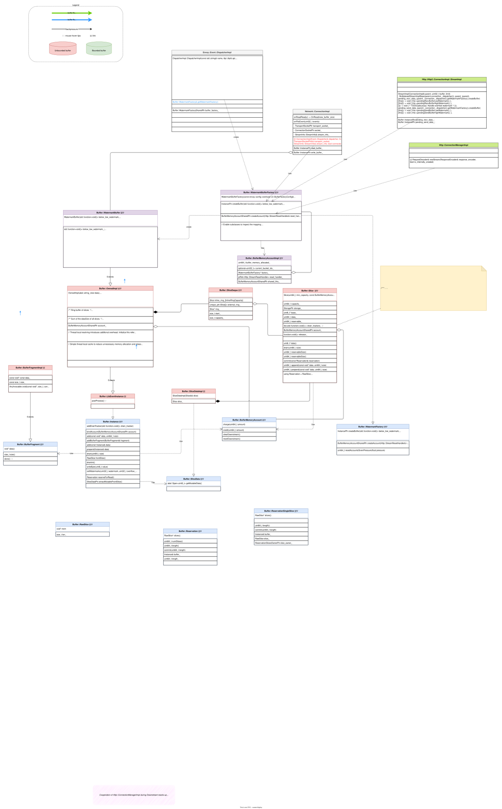

# Buffer


Envoy 的 `Buffer` (`Buffer::OwnedImpl`) 是其高性能设计的基石之一。传统网络编程中常见的 `char*` 数组或 `std::vector<char>` 这类连续内存缓冲区，在需要频繁增长或移动数据时，会涉及大量的内存分配和数据拷贝，从而导致严重的性能开销。

为了解决这个问题，Envoy 的 `Buffer` 设计遵循了以下几个核心原则：**零拷贝（Zero-Copy）**、**分片管理（Slice-based Management）** 和 **水位线流控（Watermark-based Flow Control）**。


## 总述


### 1. 核心数据结构：非连续的“切片链”（Chain of Slices）


Envoy Buffer 最核心的设计是，它**不是一块连续的内存**。相反，它内部维护了一个**双向队列（`Buffer::SliceDeque`）**，队列中的每个元素是一个称为 `Slice` 的内存切片。

- **什么是 `Slice`？**
  - 一个 `Slice` 是一个独立的、**连续的**内存块。它通常包含一个指向内存的指针和数据长度。
  - `Buffer::OwnedImpl` 本质上就是 `Buffer::SliceDeque`。
- **这种设计的优势是什么？**
  - **避免内存重分配和拷贝**：当需要向 Buffer 中添加数据时，Envoy 无需像 `std::vector` 那样在空间不足时重新分配一个更大的连续内存块，然后将旧数据拷贝过去。它只需要在队列末尾添加一个新的 `Slice` 即可。这使得追加（append）操作非常高效。
  - **高效的数据消耗（Drain）**：当数据从 Buffer 中被消耗时，Envoy 只需从队列头部移除 `Slice` 或调整第一个 `Slice` 的起始指针，而无需移动后面所有的数据。


### 2. 零拷贝操作（Zero-Copy Operations）


基于切片链的设计，Envoy 可以实现高效的零拷贝操作，这对于代理性能至关重要。

- move() 操作:

  这是最典型的零拷贝操作。当你需要将一个 Buffer 的数据 “移动” 到另一个 Buffer 时（例如，从 downstream 连接的 read buffer 移动到 upstream 连接的 write buffer），Envoy 并不拷贝任何实际的字节数据。它只是将源 Buffer 的 Slice 队列的所有权转移给目标 Buffer。这个操作仅涉及指针操作，速度极快。


### 3. 内存管理与分配


为了进一步提升效率和减少内存碎片，Envoy 的 Buffer 在分配 `Slice` 时也做了优化。

- **固定大小的内存块**: `Slice` 通常是从一个内存池中分配的，并且大小是固定的（例如 16KB）。当需要添加少量数据时，会复用最后一个 `Slice` 的剩余空间；如果空间不足或没有 `Slice`，则会分配一个全新的、标准大小的 `Slice`。
- **减少 `malloc` 调用**: 通过池化和固定大小的分配策略，Envoy 减少了对系统调用 `malloc`/`free` 的频繁请求，从而降低了内存管理的开销。


### 4. 水位线与流控（Watermarks and Flow Control）


Buffer 的大小是 Envoy 实现网络流控的关键。

- **高水位线 (High Watermark)**: 每个连接的缓冲区都有一个“高水位线”配置。当 Buffer 中累积的数据总量超过这个阈值时，Envoy 会停止从数据源（如 downstream TCP连接）读取数据。这可以有效防止因为 upsteam 消费慢而导致代理内存耗尽，即所谓的**背压（Backpressure）**机制。
- **低水位线 (Low Watermark)**: 当 Buffer 中的数据被消耗，使其总量低于“低水位线”时，Envoy 会重新开始从数据源读取数据。

这种“启停式”的机制确保了 Envoy 在处理快慢不一的上下游连接时能够保持稳定和健壮。


### 5. 线性化（Linearize）


尽管非连续内存设计非常高效，但某些场景（如与需要连续内存的库或系统调用交互）仍然需要一块完整的内存。为此，Envoy 提供了 `linearize()` 方法。

- `linearize(size)`: 这个方法会开辟一块新的连续内存，并将 Buffer 中指定长度的数据从各个 `Slice` 中拷贝到这块新内存里。
- 这是一个**性能损耗较大**的操作，因为它打破了零拷贝的原则。因此，Envoy 的内部逻辑会尽可能地避免调用它，只在绝对必要时才使用。


### 总结

总而言之，Envoy Proxy 的 `Buffer` 设计是一个高度优化的实现，其精髓在于：

- **用 `Slice` 链（非连续内存）代替传统连续内存**，从根本上避免了昂贵的内存重分配和数据移动。
- **以 `move()` 等操作实现高效的零拷贝**，极大提升了数据在代理内部流转的性能。
- **结合水位线机制实现强大的流控**，保证了代理在不同网络状况下的稳定性和弹性。


## Buffer framework


:::{figure-md}
:class: full-width



*图：Buffer 类图*  
:::
*[用 Draw.io 打开](https://app.diagrams.net/?ui=sketch#Uhttps%3A%2F%2Fenvoy-insider.mygraphql.com%2Fzh_CN%2Flatest%2F_images%2Fbuffer-classes.drawio.svg)*


上图信息量比较大，有兴趣的学习可以细心参透。简要罗列以下几方面：

1. 基本的 Buffer 抽象设计：其中包括
   1.  `Buffer::Instance` 的基本 add/prepend 等等读写操作
   2. watermark 的概念
   3. Reservation 的概念
   4. Buffer Memory Account 的概念
2. Buffer 的实现
   1. Slice 的概念
   2. `Buffer::SliceDeque` 的队列设计
3. 外部子系统与 Buffer 的互动
   1. 流控配置如果应用到各外部子系统
   2. 外部子系统如何利用 Buffer 构架的 watermark 等等功能，实现流控


## Flow Control and Buffer


在 Envoy Proxy 中，流的 Buffer 限制主要通过**流量控制机制**以及与 **HTTP/2 和 HTTP/3 连接**相关的设置来管理。

以下是 Stream Buffer 处理方式和相关配置的详细说明：

### 流量控制与水位线

Envoy 通过其内部 Buffer 的**高水位线 (high watermark)** 和**低水位线 (low watermark)** 来实现流量控制。当某个 Buffer （例如，用于某个流的 Buffer ）超过其高水位线时，Envoy 会向数据源（upstream 或 downstream）发出信号，要求暂停发送数据。当 Buffer 排空并低于低水位线时，数据流将恢复。


当 Envoy 使用**非流式 L7(http) filter**（例如 transcoder 或 [http buffer filter](https://www.envoyproxy.io/docs/envoy/latest/configuration/http/http_filters/buffer_filter)），并且请求或响应体**超出 L7 缓冲区限制**时，流量控制可能会导致问题(hard limits)。

对于**请求**，如果请求体必须缓冲且超出配置的限制，Envoy 将向用户返回 **413 错误**，并增加 `downstream_rq_too_large` 指标。

在**响应**路径上，如果响应体必须缓冲且超出限制，Envoy 将增加 `rs_too_large` 指标，并可能：

- **中断响应**（如果响应头已发送到 downstream）。
- 发送 **500 错误响应**。


概念上，流控可以分为两种层次，分别是：

- Network Flow Control (可理解 L3/L4 为 TCP/IP 层控制)
  - listener limits (downstream)
  - cluster limits (upstream)
- HTTP Flow Control (可理解为 L7 HTTP 层控制)
  - http2 stream limits

### Network Flow Control

#### listener per_connection_buffer_limit_bytes

listener limits 适用于每次 read() 调用从 downstream 读取的原始数据量，以及 Envoy 和 downstream 之间在用户空间中缓冲的数据量。 

listener  limits 也会传播到 HttpConnectionManager，所以：

- 对于HTTP/1.1 ：基于每个 http steam 应用于下文所述的 HTTP/1.1 L7 buffer。因此，它们限制了可缓冲的 HTTP/1 请求和响应主体的大小。

- 对于 HTTP/2 和 HTTP/3：由于多个流可以在一个连接上复用，因此可以分别调整 L7 和 L4 buffer limits，并且 http 的 配置选项 `initial_connection_window_size` 将应用于所有 L7  buffer 。

请注意，对于所有版本的 HTTP，Envoy 可以在所有 L7  filter 都是流式传输的路由路径(routes)上代理任意大的 http body ，但许多 http filter（例如 transcoder 或 [http buffer filter](https://www.envoyproxy.io/docs/envoy/latest/configuration/http/http_filters/buffer_filter)）需要缓冲完整的 HTTP body，这种情况下， listener limits 会限制请求和响应的大小。

```yaml
static_resources:
  listeners:
    name: http
    address:
      socket_address:
        address: '::1'
        portValue: 0
    filter_chains:
      filters:
        name: envoy.filters.network.http_connection_manager
        ...
    per_connection_buffer_limit_bytes: 1024
```


#### cluster per_connection_buffer_limit_bytes

 `per_connection_buffer_limit_bytes` 很重要。这是 **cluster** 级别上的一个设置，定义了 cluster 连接的读写 Buffer 的软限制。如果未指定，则会应用一个实现定义的默认值（通常是 1MiB）。此限制适用于**整个连接**，因此会影响该连接上的所有多路复用流。如果一个 http connection buffer 已满，最终也会影响各个 http stream。


cluster 限制会影响每次 read() 调用从 upstream 读取的原始数据量，以及在 Envoy 和 upstream 之间的用户空间中 buffer 的数据量。


**`per_connection_buffer_limit_bytes` 的配置示例（集群配置）:**

```yaml
clusters:
- name: my_upstream_cluster
  connect_timeout: 5s
  type: LOGICAL_DNS
  per_connection_buffer_limit_bytes: 32768 # 32 KB (32千字节), 对不受信任的 upstream 很有用
  lb_policy: ROUND_ROBIN
  load_assignment:
    cluster_name: my_upstream_cluster
    endpoints:
    - lb_endpoints:
      - endpoint:
          address:
            socket_address:
              address: example.com
              port_value: 80
```


**作用对象**: 这个参数是针对 **Envoy 集群 (Cluster)** 的，它定义了 Envoy 与 upstream 集群中**每个连接**的**读写缓冲区大小**。

**目的**: 这个设置控制的是 Envoy 在其内部为每个 TCP 连接（无论是 HTTP/1.1 还是 HTTP/2 连接）分配的**用户空间缓冲区**的软限制。它主要用于防止 Envoy 自身因缓冲过多的数据而耗尽内存。

**性质**: 这是一个**Envoy 内部的资源管理和背压机制**。当 Envoy 与 upstream 建立的某个连接的读或写缓冲区达到这个限制时，Envoy 会触发内部的流量控制回调（例如，停止从套接字读取数据），从而将背压传递给下游或上游。

**影响**: 它影响 Envoy 进程的内存使用，尤其是在有大量并发连接或慢速上游/下游的情况下。如果未指定，Envoy 会使用一个默认值（通常是 1MiB）。


### HTTP Flow Control

#### initial_stream_window_size

对于 HTTP/2 和 HTTP/3，控制**每 Stream Buffer **的主要机制是**初始流级别流量控制接收窗口大小 (initial stream-level flow-control receive window size)**。此设置规定了 Envoy 在从对端收到窗口更新之前，允许对端在一个流上发送多少数据。


`initial_stream_window_size`: 此参数位于 `http2_protocol_options` 或 `quic_protocol_options`（用于 HTTP/3）配置中。

* **对于 HTTP/2**: 您可以在 cluster 或 listener 上的 `http_protocol_options` 或 `http2_protocol_options` 中配置此项。它作为 Envoy 在发送和接收 Buffer 中为每个 Stream Buffer 的字节数的软限制。
* **对于 HTTP/3 (QUIC)**: 它作为 `initial_stream_window_size` 在 cluster 或 listener 的 `quic_protocol_options` 下可用。


####  initial_connection_window_size

- **作用对象**: 这个参数是针对 **HTTP/2 协议**的，它定义了 HTTP/2 连接级别的**流量控制窗口大小**。
- **目的**: 在 HTTP/2 中，流量控制是端到端的，既有流级别的窗口，也有连接级别的窗口。`initial_connection_window_size` 决定了在不收到对端窗口更新帧的情况下，Envoy 允许在一个 HTTP/2 连接上发送或接收的**总字节数**。
- **性质**: 这是一个**协议层面的流量控制机制**。当连接上的数据传输量达到这个窗口大小时，Envoy 会暂停在该连接上发送更多数据，直到对端发送一个窗口更新帧来“打开”更多的窗口空间。它确保了发送方不会压垮接收方，是 HTTP/2 协议固有的背压机制。
- **影响**: 它直接影响 HTTP/2 连接的吞吐量和缓冲区使用，但其核心是协议规范的一部分，用于管理数据流。


HTTP/2 的配置示例（cluster 配置）:

```yaml
clusters:
- name: my_upstream_cluster
  connect_timeout: 5s
  type: LOGICAL_DNS
  lb_policy: ROUND_ROBIN
  typed_extension_protocol_options:
    envoy.extensions.upstreams.http.v3.HttpProtocolOptions:
      "@type": type.googleapis.com/envoy.extensions.upstreams.http.v3.HttpProtocolOptions
      explicit_http_config:
        http2_protocol_options:
          initial_stream_window_size: ...
          # max_concurrent_streams: ...
          initial_connection_window_size: ...
  load_assignment:
    cluster_name: my_upstream_cluster
    endpoints:
    - lb_endpoints:
      - endpoint:
          address:
            socket_address:
              address: example.com
              port_value: 80
```


### 这些设置为何重要

  * **资源管理**: 限制 Buffer 大小有助于防止 Envoy 占用过多的内存，特别是在 upstream 服务缓慢的情况下。
  * **流量控制**: 它们对于**背压**至关重要，确保快速的发送方不会压垮慢速的接收方，从而防止 OOM（内存溢出）问题。
  * **DDoS 保护**: 缓冲可以通过在转发请求之前缓冲整个请求来保护 upsteam 服务器免受慢速攻击，确保 upsteam 以 Envoy 的速度接收请求，而不是 downstream 的速度。

**主要总结：**

  * 对于 HTTP/2 和 HTTP/3，主要通过协议选项中的 `initial_stream_window_size` 来控制每 Stream Buffer 。


## 参考

- [How do I configure flow control?](https://www.envoyproxy.io/docs/envoy/latest/faq/configuration/flow_control#how-do-i-configure-flow-control)

