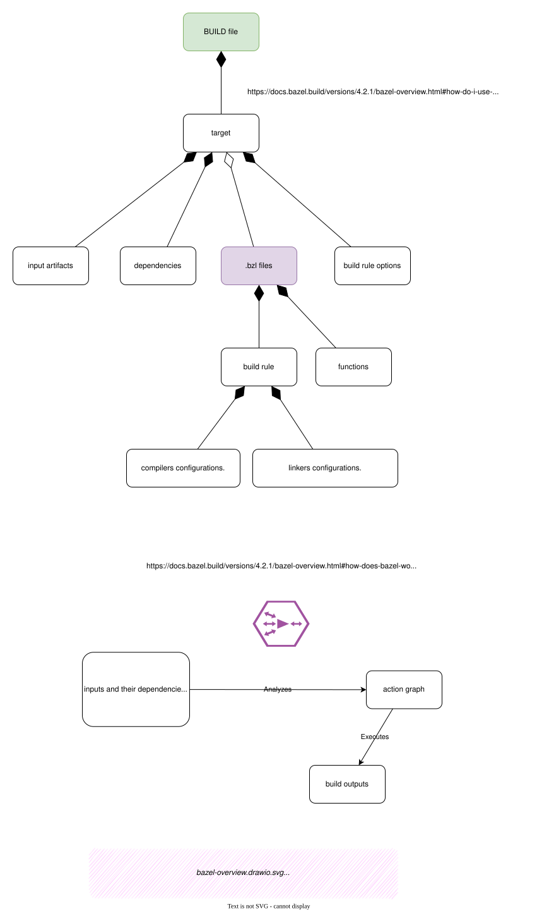

# Bazel 概述

## Bazel 概念与对象




*[用 Draw.io 打开 bazel-overview.drawio.svg](https://app.diagrams.net/?ui=sketch#Uhttps%3A%2F%2Fblog.mygraphql.com%2Fzh%2Fnotes%2Fcc%2Fbazel%2Fbazel-overview.drawio.svg)*




*[用 Draw.io 打开 bazel-concept.drawio.svg](https://app.diagrams.net/?ui=sketch#Uhttps%3A%2F%2Fblog.mygraphql.com%2Fzh%2Fnotes%2Fcc%2Fbazel%2Fbazel-concept.drawio.svg)*




*[用 Draw.io 打开 bazel-external-dep.drawio.svg](https://app.diagrams.net/?ui=sketch#Uhttps%3A%2F%2Fblog.mygraphql.com%2Fzh%2Fnotes%2Fcc%2Fbazel%2Fbazel-external-dep.drawio.svg)*


## CPP  use cases


### Adding include paths

> https://bazel.build/tutorials/cpp-use-cases#add-include-paths

Sometimes you cannot (or do not want to) root include paths at the workspace root. Existing libraries might already have an include directory that doesn't match its path in your workspace. For example, suppose you have the following directory structure:

```
└── my-project
    ├── legacy
    │   └── some_lib
    │       ├── BUILD
    │       ├── include
    │       │   └── some_lib.h
    │       └── some_lib.cc
    └── WORKSPACE
```

Bazel will expect `some_lib.h` to be included as `legacy/some_lib/include/some_lib.h`, but suppose `some_lib.cc` includes `"some_lib.h"`. To make that include path valid, `legacy/some_lib/BUILD` will need to specify that the `some_lib/include` directory is an include directory:

```python
cc_library(
    name = "some_lib",
    srcs = ["some_lib.cc"],
    hdrs = ["include/some_lib.h"],
    copts = ["-Ilegacy/some_lib/include"],
)
```

This is especially useful for external dependencies, as their header files must otherwise be included with a `/` prefix.


### Include external libraries

> https://bazel.build/tutorials/cpp-use-cases#include-external-libraries

Suppose you are using [Google Test](https://github.com/google/googletest) {: .external}. You can use one of the repository functions in the `WORKSPACE` file to download Google Test and make it available in your repository:

```python
load("@bazel_tools//tools/build_defs/repo:http.bzl", "http_archive")

http_archive(
    name = "gtest",
    url = "https://github.com/google/googletest/archive/release-1.10.0.zip",
    sha256 = "94c634d499558a76fa649edb13721dce6e98fb1e7018dfaeba3cd7a083945e91",
    build_file = "@//:gtest.BUILD",
)
```

**Note:** If the destination already contains a `BUILD` file, you can leave out the `build_file` attribute.

Then create `gtest.BUILD`, a `BUILD` file used to compile Google Test.

```python
cc_library(
    name = "main",
    srcs = glob(
        ["googletest-release-1.10.0/googletest/src/*.cc"],
        exclude = ["googletest-release-1.10.0/googletest/src/gtest-all.cc"]
    ),
    hdrs = glob([
        "googletest-release-1.10.0/googletest/include/**/*.h",
        "googletest-release-1.10.0/googletest/src/*.h"
    ]),
    copts = [
        "-Iexternal/gtest/googletest-release-1.10.0/googletest/include",
        "-Iexternal/gtest/googletest-release-1.10.0/googletest"
    ],
    linkopts = ["-pthread"],
    visibility = ["//visibility:public"],
)
```


### Writing and running C++ tests

> https://bazel.build/tutorials/cpp-use-cases#run-c-tests


For example, you could create a test `./test/hello-test.cc`, such as:

```cpp
#include "gtest/gtest.h"
#include "main/hello-greet.h"

TEST(HelloTest, GetGreet) {
  EXPECT_EQ(get_greet("Bazel"), "Hello Bazel");
}
```

Then create `./test/BUILD` file for your tests:

```python
cc_test(
    name = "hello-test",
    srcs = ["hello-test.cc"],
    copts = [
      "-Iexternal/gtest/googletest/include",
      "-Iexternal/gtest/googletest",
    ],
    deps = [
        "@gtest//:main",
        "//main:hello-greet",
    ],
)
```

To make `hello-greet` visible to `hello-test`, you must add `"//test:__pkg__",` to the `visibility` attribute in `./main/BUILD`.

Now you can use `bazel test` to run the test.

```
bazel test test:hello-test
```

This produces the following output:

```
INFO: Found 1 test target...
Target //test:hello-test up-to-date:
  bazel-bin/test/hello-test
INFO: Elapsed time: 4.497s, Critical Path: 2.53s
//test:hello-test PASSED in 0.3s

Executed 1 out of 1 tests: 1 test passes.
```


## External Dependency

### Directory layout

> https://bazel.build/external/overview#directory-layout

After being fetched, the repo can be found in the subdirectory `external` in the [output base](https://bazel.build/remote/output-directories), under its canonical name.

You can run the following command to see the contents of the repo with the canonical name `canonical_name`:

```sh
ls $(bazel info output_base)/external/ canonical_name 
```


e.g:

```bash
/workspaces/envoy$ bazel info output_base
/build/.cache/bazel/_bazel_vscode/2d35de14639eaad1ac7060a4dd7e3351
```


## Inspect

### Query

> https://bazel.build/query/guide
>
> https://bazel.build/query/language


#### dependency graph

> https://bazel.build/tutorials/cpp-dependency

```bash
bazel query --notool_deps --noimplicit_deps "deps(//main:hello-world)" \
  --output graph
```

Envoy repo as example:
```bash
bazel query "deps(//source/exe:envoy)"

bazel query --notool_deps "deps(//source/exe:envoy)" --output graph | dot -Tsvg > /tmp/deps.svg

```


#### What packages exist beneath(下面) `//source/`

```
$ bazel query '//source/...' --output package | head
Loading: 0 packages loaded
source/common/access_log
source/common/api
source/common/buffer
source/common/common
source/common/config
source/common/conn_pool
source/common/crypto
source/common/event
source/common/filesystem
source/common/filter
```


#### What rules are defined in the `//source/exe` package?

```
$ bazel query 'kind(rule, //source/exe:*)' --output label_kind | head
Loading: 0 packages loaded
alias rule //source/exe:envoy
cc_binary rule //source/exe:envoy-static
cc_library rule //source/exe:envoy_common_lib
cc_library rule //source/exe:envoy_common_lib_with_external_headers
cc_library rule //source/exe:envoy_common_with_core_extensions_lib
cc_library rule //source/exe:envoy_common_with_core_extensions_lib_with_external_headers
cc_library rule //source/exe:envoy_main_common_lib
cc_library rule //source/exe:envoy_main_common_lib_with_external_headers
cc_library rule //source/exe:envoy_main_common_with_core_extensions_lib
cc_library rule //source/exe:envoy_main_common_with_core_extensions_lib_with_external_headers
```


#### What files are generated by rules in the `foo` package?

```
$ bazel query 'kind("generated file", //source/exe:*)'
//source/exe:envoy-static.dwp
//source/exe:envoy-static.stripped
Loading: 0 packages loaded
```


